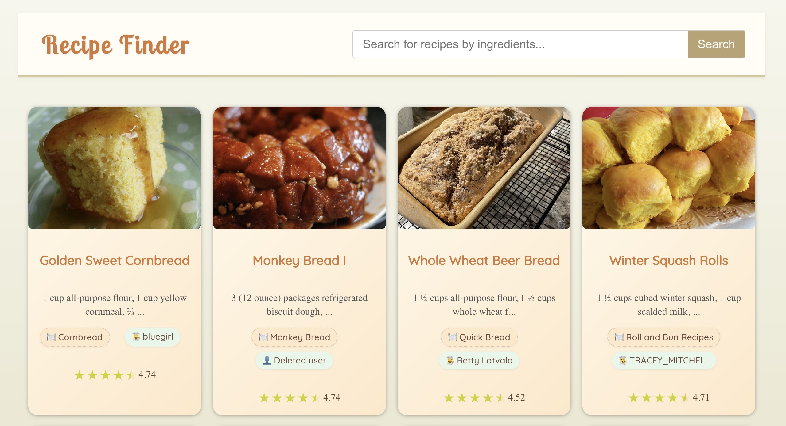

# 🥘 Recipe Finder — Frontend

Task on hand: It's dinner time! Create an application that helps users find the most relevant recipes that they can prepare with the ingredients that they have at home

---

A lightweight React frontend for the Recipe Finder API, allowing users to search for recipes based on the ingredients they have at home.

🌐 **Live Demo**: [recipe-time-frontend.onrender.com](https://recipe-time-frontend.onrender.com)

💻 **Backend repo**: [github.com/ibalosh/recipe_finder_backend](https://github.com/ibalosh/recipe_finder_backend)



---

## 💡 Features

- 🔍 **Ingredient Search**: Type in one or more ingredients (e.g. `eggs milk`) to search for recipes that best match your input.
- ⏳ **Loading Feedback**: Gradual UI feedback while data is loading, ensuring smooth user experience.
- ❌ **Graceful Error Handling**: Displays informative messages when no data is found or if the API is unreachable.
- 📄 **Pagination**: Paginated results with clear navigation between pages.
- ⚡ **TanStack Query**:
    - Handles data fetching, caching, and error/loading states.
    - Efficiently manages repeated requests to prevent unnecessary API calls.
- 🧭 **React Router**:
    - Basic routing setup using `react-router-dom`
    - Supports detail pages for individual recipes via routes like `/recipes/:id`

---

## 🚀 Tech Stack

- [React](https://reactjs.org/)
- [TanStack Query (React Query)](https://tanstack.com/query/latest)
- [React Router DOM](https://reactrouter.com/)
- Fetches data from [Recipe Finder Backend - Rails API](https://github.com/ibalosh/recipe_time)

---

## 🛠 Development

To run locally:

```bash
npm install
npm dev
```

Ensure your `.env` file contains the API URL and token.

```env
VITE_API_BASE_URL=http://example.com
VITE_API_TOKEN=token
```
You can see an example in `.env.example` file.

